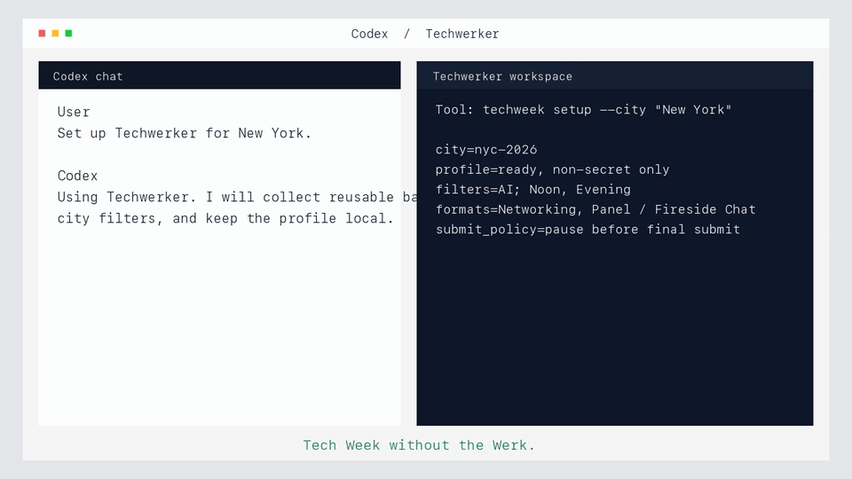
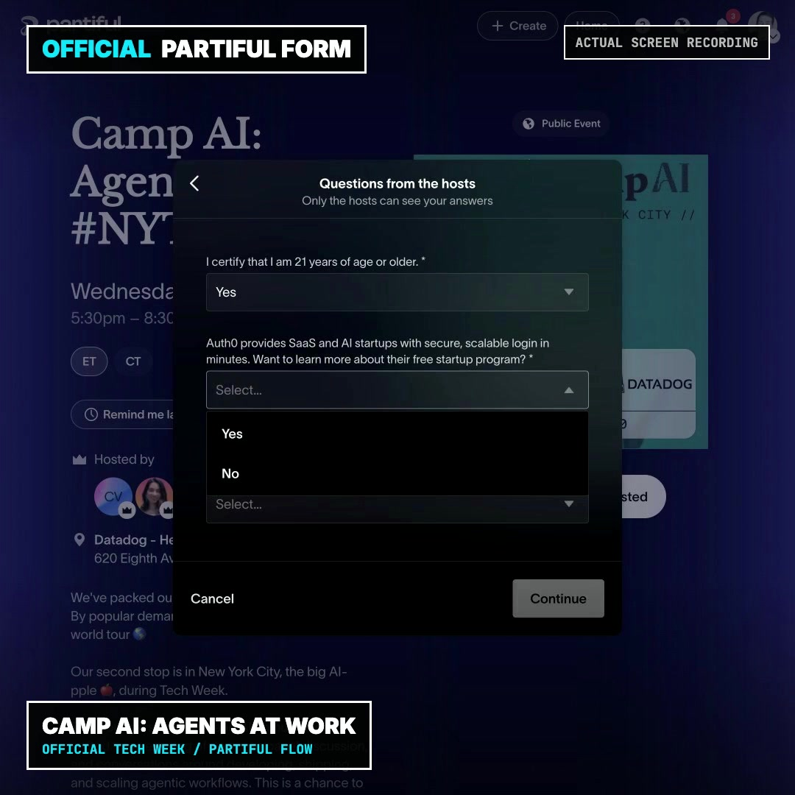
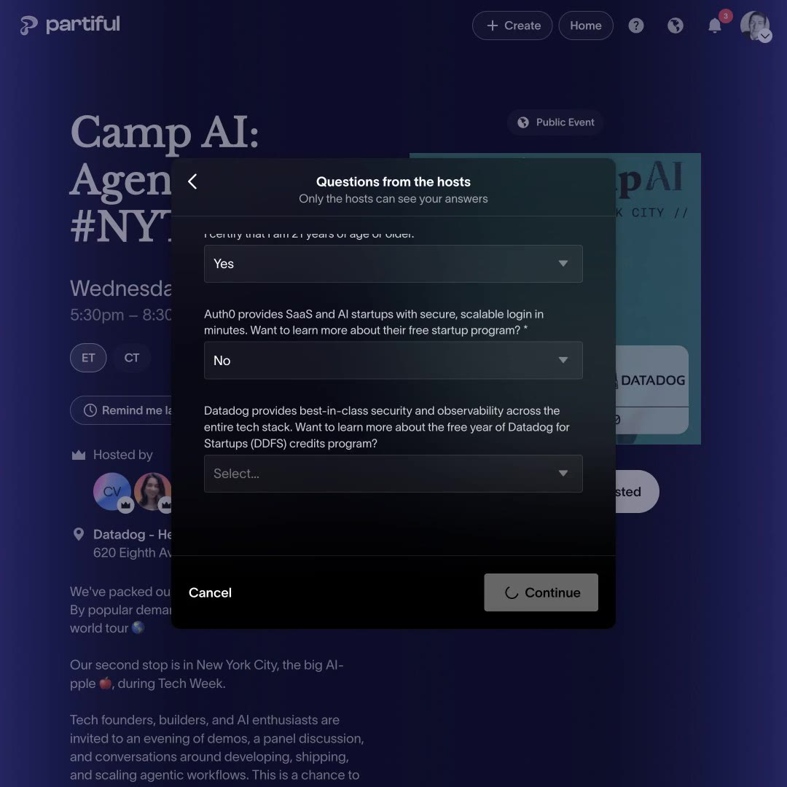
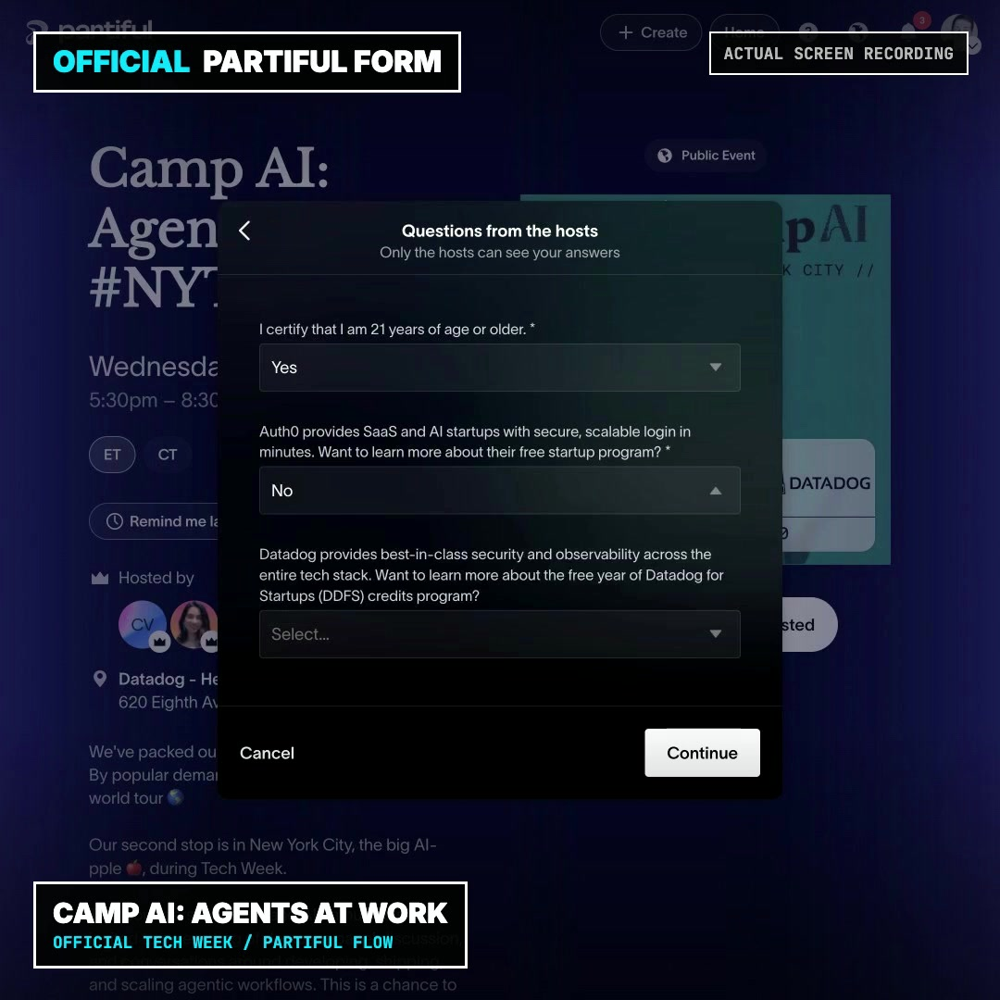
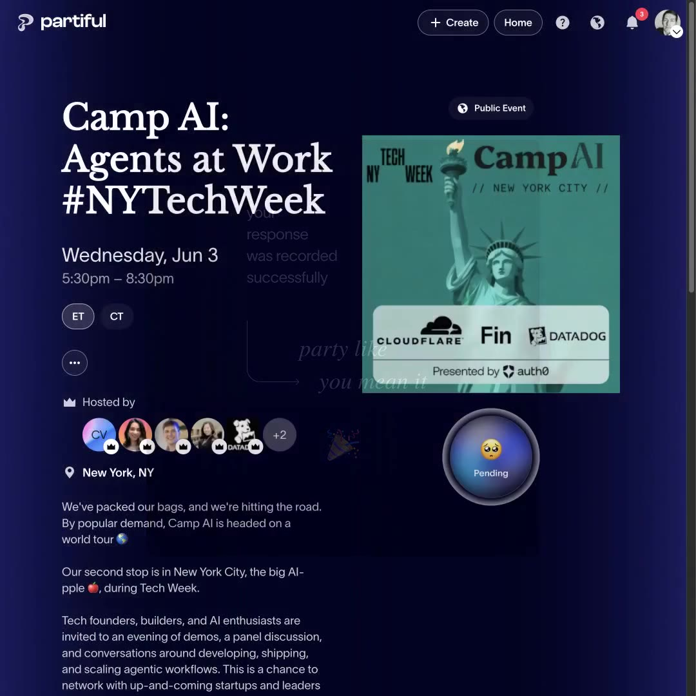

# Techwerker

**Takes the work out of Tech Week.**

Techwerker is a local Codex plugin for Tech Week attendees. It helps Codex review dense Tech Week calendars, select a realistic RSVP portfolio, open official Partiful pages, complete tedious repeated forms, and work the RSVP queue safely.

## New To Codex? Start Here

Codex is an AI assistant app for your Mac. You can chat with it, and it can also work with files, tools, and browser-control plugins when you allow it.

Techwerker is an add-on for Codex. After you install it, you do not need to learn command lines or event IDs. You just talk to Codex like this:

```text
Use Techwerker. Get started.
Find me a cool AI event on Tuesday afternoon near Williamsburg.
Yes, get me on the list for that one.
```

Here is what happens behind the scenes:

1. Codex asks for your city and basic RSVP details once.
2. Techwerker reads the official Tech Week calendar.
3. Codex recommends events that match your interests, time, and neighborhood.
4. When you approve an event, Codex opens the official Partiful page in its in-app browser, or in Chrome if you have enabled Codex's Chrome plugin and want to use your existing signed-in browser state.
5. Codex fills repeated fields it already knows, like your name, email, company, title, and LinkedIn.
6. If the form asks something new, Codex pauses and asks you.
7. After you say yes for that event, Codex clicks the right RSVP, waitlist, or Continue buttons.
8. Techwerker records what happened locally so you can keep working through the queue.

It is meant to remove rote signup work, not to secretly submit things without you. It stops for logins, one-time codes, payment, captchas, or required questions it cannot answer safely.

You tell it what you care about once. Then you can ask for things like:

```text
What can you do?
Get started.
Find me a cool AI event on Tuesday afternoon near Williamsburg.
Find the best AI hackathons for me.
Yes, get me on the list for that one.
Make me a day plan for June 3.
```

Techwerker handles the busywork: searching the calendar, building enough good options per time slot to survive waitlists, avoiding unrealistic neighborhood hops, opening the right pages, filling known or visibly prefilled fields, clicking the scoped RSVP/list controls you authorized, and tracking what happened.

It understands plain-English planning requests. “Tuesday afternoon near Williamsburg” becomes a real date/time/location query with New York neighborhood awareness, not just a text search. The same pattern works for supported neighborhoods across the city, such as SoHo, Chelsea, Midtown, Union Square, Tribeca, Brooklyn, Queens, and Upper Manhattan.

It does not guarantee event acceptance or bypass host rules. It gives Codex a safer, faster workflow for planning and authorized RSVP attempts.

> Techwerker is not affiliated with, endorsed by, or sponsored by Tech Week, a16z, Partiful, or any event host.

## Compatibility

Techwerker's calendar planning and local RSVP state helpers are ordinary Codex plugin workflows. The proved live Partiful RSVP path is Mac-first today: it relies on Codex Desktop's in-app Browser Use tab for official Partiful pages, visible form filling, and scoped click-through. If Codex's Chrome plugin is installed and enabled, Chrome can be an optional path for users who want Codex to use their existing Chrome tabs, cookies, and login state. Computer Use remains only a macOS desktop fallback for explicit external-browser debugging. Non-Mac users can still use the planning and local-state helpers, but live RSVP control depends on which Codex browser-control tools are available in their environment.

## Why Use It

Tech Week is fun, but the signup process is a lot of work:

- too many events to scan by hand,
- waitlists and approval flows everywhere,
- the same RSVP fields over and over,
- hidden locations until you are accepted,
- too many tabs and links to track.

Techwerker turns that into a chat flow inside Codex.

## How It Works

1. You choose a city: New York, Boston, or San Francisco.
2. You enter basic non-secret RSVP info once: name, email, phone, company, role, country, LinkedIn, and interests.
3. Techwerker builds an overlap-aware portfolio with backups for each date/time slot, because many events waitlist or reject.
4. It keeps the plan location-aware so accepted events can turn into a realistic day instead of a cross-city scramble.
5. When you say “get me on the list,” Codex works through the official signup page and clicks RSVP/Continue for that event when it is safe to do so.
6. If a form asks something new, Techwerker asks once and can remember the answer for next time.

New York and Boston are treated as launched calendar cities when their public pages are parseable. San Francisco is first-class too, but if `https://tech-week.com/calendar/san-francisco` returns 404, Techwerker reports it as pending instead of pretending there are events.

Codex may notice visible account details or previous Partiful responses in the active form. Techwerker can use those visible non-sensitive values for the current RSVP, but should ask before saving them as reusable memory. It can draft harmless answers to generic prompts like “Why do you want to attend?” from the event and your saved preferences, but it does not invent factual personal data. It does not store passwords, one-time codes, payment details, captcha answers, or private notes.

## See It Work



Actual frames from the hybrid reviewer demo:

| Plain-English request | Official calendar |
| --- | --- |
|  |  |

| Official Partiful | Live Pending proof |
| --- | --- |
|  |  |

The square X/Twitter demo artifact is [assets/techwerker-reviewer-demo.mp4](assets/techwerker-reviewer-demo.mp4). It combines the polished overview with a trimmed live `Camp AI: Agents at Work` Partiful proof that reaches visible `Pending`. The immediate cleanup/removal is documented in [docs/release-evidence.md](docs/release-evidence.md), but not included in the shareable cut.

Example:

```text
You: Find me a cool AI event on Wednesday evening near Midtown.

Techwerker: Best match: Camp AI: Agents at Work on Wednesday evening in Midtown.

You: Yes, get me on the list.

Techwerker: I’ll open the official Partiful page, fill the RSVP fields I know, work through each host-question step, click the scoped RSVP/list flow for that event, and stop if it needs a login code, site error, or unknown factual answer.
```

Reviewer proof lives in [docs/release-evidence.md](docs/release-evidence.md): the current deterministic gates, live Partiful proof, and the exact non-claims that keep the public beta honest.

## Install

For non-developers using the Codex app for Mac, the intended flow is:

1. Open **Codex for Mac**.
2. Open **Settings**.
3. Open **Plugins**.
4. Choose **Add marketplace**, **Install from GitHub**, or the equivalent plugin-install button in your Codex build.
5. Paste this repo URL:

```text
https://github.com/daniel-p-green/techwerker
```

6. Approve installing/enabling the `Techwerker` plugin when Codex asks.
7. Start a new Codex chat and type:

```text
Use Techwerker. What can you do?
```

You know it is working when Codex explains that Techwerker can plan Tech Week, remember your non-secret RSVP basics, recommend events, and work official Partiful RSVP pages after you authorize a selected event.

Expected prompts later:

- Codex may ask for your city and basic RSVP details once.
- Codex may ask to use the in-app browser for official Tech Week or Partiful pages.
- If you enable Codex's Chrome plugin, Codex may ask to use your signed-in Chrome browser instead. Use this when you want existing Partiful login state or open tabs; browser pages may contain sensitive information, so stay attentive.
- Partiful may ask you to log in or enter a one-time code. Techwerker stops for that; you handle the login/code yourself.
- You should not need to run commands, copy event IDs, or paste the same RSVP fields into every form.

If your Codex build does not yet show a GitHub plugin install button, the reliable fallback is to paste this one command into Terminal:

```bash
codex plugin marketplace add daniel-p-green/techwerker
```

## Start

Inside Codex, ask:

```text
Use Techwerker. What can you do?
```

Then:

```text
Get started.
```

## Safety

Techwerker keeps helper state locally on your machine. It stores only non-secret RSVP details and preferences.

It should stop and ask you when a page needs:

- a login or one-time code,
- a payment detail,
- a captcha,
- a required question it has not seen before,
- a final confirmation that does not clearly belong to the selected event.

## For Developers

The optional terminal helper is available if you want to inspect or debug the underlying workflow:

```bash
./scripts/install-cli.sh
techweek setup --city "New York" --interactive
techweek cockpit --city "New York"
```

Validate the repo with:

```bash
./scripts/check.sh
```

Release-readiness diagnostics are available to developers with `techweek city-status --city all` and `techweek release-check --city all`.

Local state is stored outside the repo:

```text
~/.codex/data/tech-week/<city>-<year>/
```

## License

MIT
